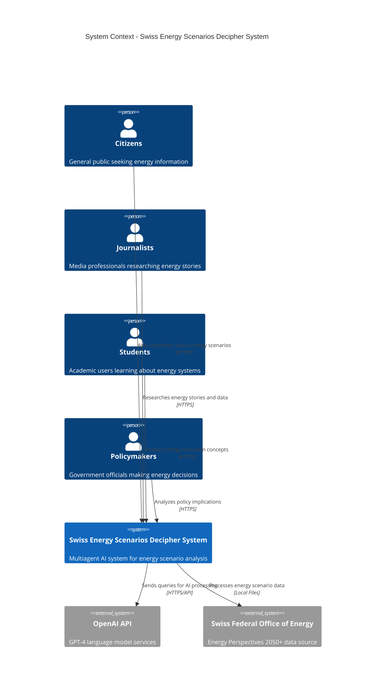
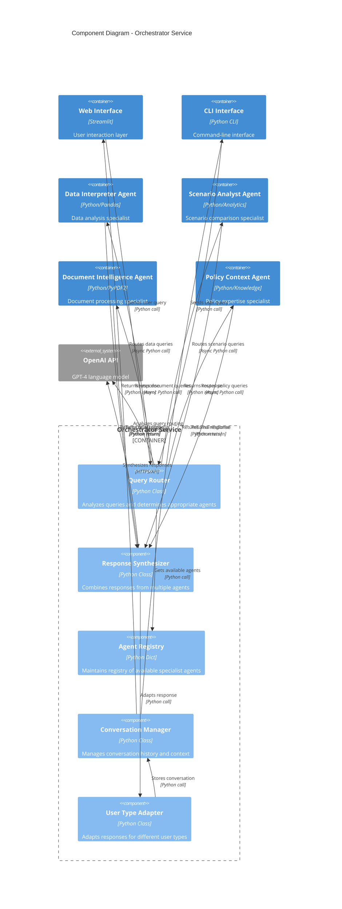
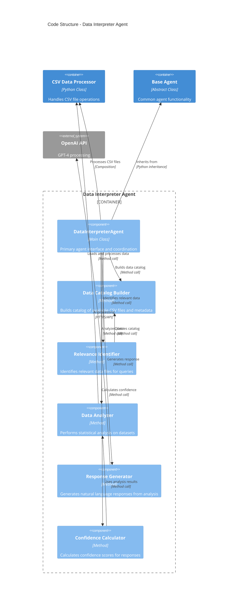
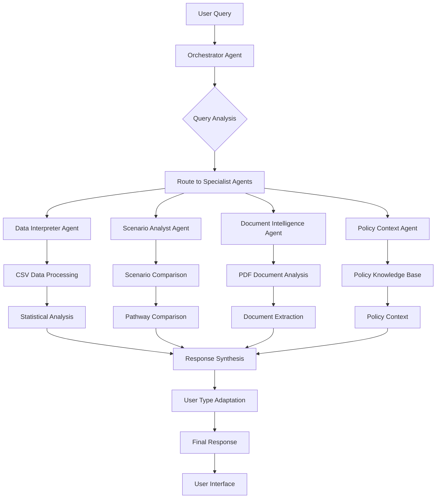
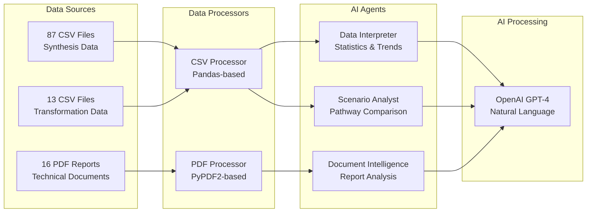
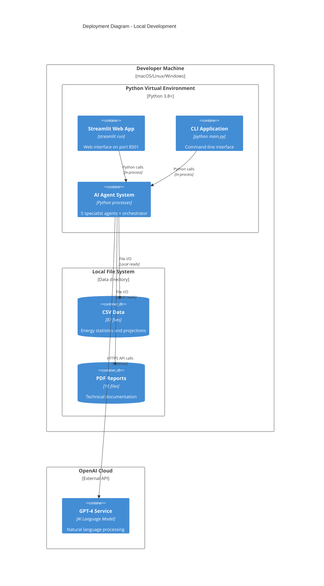
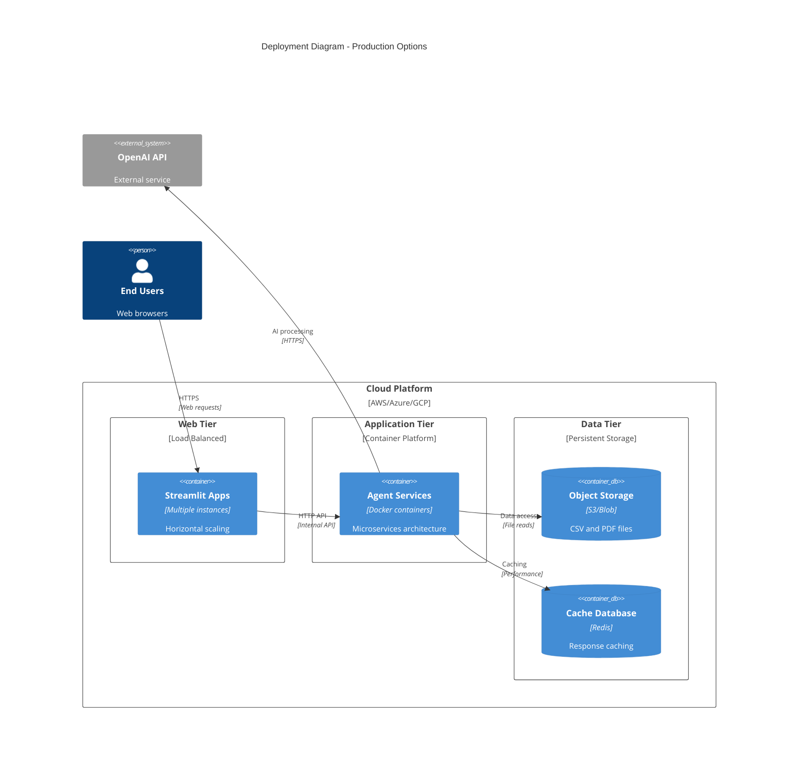

# 🇨🇭 Swiss Energy Scenarios Decipher System - C4 Architecture Documentation

## Overview

The Swiss Energy Scenarios Decipher System is a multiagent AI application that transforms complex energy scenario data into accessible insights for citizens, journalists, students, and policymakers.

---

## Level 1: System Context Diagram

### Key External Entities:
- **Citizens, Journalists, Students, Policymakers**: Primary user groups with different information needs
- **OpenAI API**: Provides GPT-4 language model capabilities for intelligent query processing
- **Swiss Federal Office of Energy**: Source of Energy Perspectives 2050+ datasets and reports

---

## Level 2: Container Diagram

```mermaid
C4Container
    title Container Diagram - Swiss Energy Scenarios Decipher System

    Person(users, "System Users", "Citizens, Journalists, Students, Policymakers")

    Container_Boundary(system, "Swiss Energy Scenarios Decipher System") {
        Container(web_ui, "Web Interface", "Streamlit", "Modern web-based user interface with interactive features")
        Container(cli_ui, "CLI Interface", "Python CLI", "Command-line interactive chat interface")
        
        Container(orchestrator, "Orchestrator Service", "Python/AsyncIO", "Central coordinator that routes queries and synthesizes responses")
        
        Container(data_agent, "Data Interpreter Agent", "Python/Pandas", "Analyzes CSV energy data and provides statistics")
        Container(scenario_agent, "Scenario Analyst Agent", "Python/Analytics", "Compares energy transition scenarios")
        Container(doc_agent, "Document Intelligence Agent", "Python/PyPDF2", "Processes PDF reports and technical documents")
        Container(policy_agent, "Policy Context Agent", "Python/Knowledge", "Provides Swiss energy policy expertise")
        
        Container(csv_processor, "CSV Data Processor", "Python/Pandas", "Handles 87 CSV files with energy statistics")
        Container(pdf_processor, "PDF Document Processor", "Python/PyPDF2", "Processes 16 technical PDF reports")
        Container(config, "Configuration Service", "Python/dotenv", "Manages API keys and system settings")
    }

    ContainerDb(data_files, "Energy Data Files", "CSV/PDF", "103 data files: synthesis data, transformation data, technical reports")

    System_Ext(openai, "OpenAI API", "GPT-4 language model")

    Rel(users, web_ui, "Interacts with", "HTTPS")
    Rel(users, cli_ui, "Uses", "Terminal")

    Rel(web_ui, orchestrator, "Sends queries", "Python calls")
    Rel(cli_ui, orchestrator, "Sends queries", "Python calls")

    Rel(orchestrator, data_agent, "Routes data queries", "Python calls")
    Rel(orchestrator, scenario_agent, "Routes scenario queries", "Python calls") 
    Rel(orchestrator, doc_agent, "Routes document queries", "Python calls")
    Rel(orchestrator, policy_agent, "Routes policy queries", "Python calls")

    Rel(data_agent, csv_processor, "Requests data analysis", "Python calls")
    Rel(scenario_agent, csv_processor, "Requests scenario data", "Python calls")
    Rel(doc_agent, pdf_processor, "Requests document analysis", "Python calls")

    Rel(csv_processor, data_files, "Reads CSV files", "File I/O")
    Rel(pdf_processor, data_files, "Reads PDF files", "File I/O")

    Rel_Back(data_agent, openai, "AI processing requests", "HTTPS/API")
    Rel_Back(scenario_agent, openai, "AI processing requests", "HTTPS/API") 
    Rel_Back(doc_agent, openai, "AI processing requests", "HTTPS/API")
    Rel_Back(policy_agent, openai, "AI processing requests", "HTTPS/API")
    Rel_Back(orchestrator, openai, "AI processing requests", "HTTPS/API")

    Rel(config, orchestrator, "Provides configuration", "Python import")

    UpdateLayoutConfig($c4ShapeInRow="3", $c4BoundaryInRow="2")
```

### Key Containers:
- **User Interfaces**: Web (Streamlit) and CLI for different interaction preferences
- **AI Agents**: 5 specialized agents for different aspects of energy analysis
- **Data Processors**: Dedicated components for CSV and PDF file processing
- **Configuration**: Centralized management of API keys and system settings

---

## Level 3: Component Diagram - Orchestrator Service

### Key Components:
- **Query Router**: Intelligent routing based on query analysis
- **Response Synthesizer**: Combines multiple agent responses coherently  
- **Agent Registry**: Dynamic management of specialist agents
- **User Type Adapter**: Customizes responses for different user personas

---

## Level 4: Code Structure - Data Interpreter Agent

---

## Data Flow Architecture

### Query Processing Flow:

### Data Processing Architecture:

---

## Deployment Architecture

### Development/Local Deployment:

### Production Deployment Options:

---

## Technical Decisions & Rationale

### Architecture Decisions:

| Decision | Rationale |
|----------|-----------|
| **Multiagent Architecture** | Enables specialization, parallel processing, and modular development |
| **Python Ecosystem** | Rich data science libraries (Pandas, NumPy), AI integration (OpenAI), rapid development |
| **Asynchronous Processing** | Enables parallel agent execution for better performance |
| **Streamlit for Web UI** | Rapid prototyping, built-in interactivity, minimal web development overhead |
| **File-based Data Storage** | Simplicity, direct access to Swiss government data formats, no database complexity |
| **OpenAI GPT-4** | State-of-the-art natural language understanding and generation |

### Agent Specialization Strategy:

| Agent | Specialization | Data Sources | Key Capabilities |
|-------|---------------|--------------|-----------------|
| **Data Interpreter** | Statistics & Analytics | 87 CSV files | Time series analysis, scenario comparison, quantitative insights |
| **Scenario Analyst** | Pathway Comparison | CSV + Knowledge | ZERO vs WWB analysis, assumption comparison, feasibility assessment |
| **Document Intelligence** | Report Processing | 16 PDF files | Methodology extraction, technical analysis, multilingual processing |
| **Policy Context** | Regulatory Knowledge | Swiss policy framework | Implementation pathways, stakeholder analysis, regulatory compliance |
| **Orchestrator** | Coordination | All agents | Query routing, response synthesis, conversation management |

---

## Quality Attributes

### Performance:
- **Parallel Processing**: Agents execute queries simultaneously using AsyncIO
- **Caching**: Data catalog and file processing results are cached
- **Streaming**: Streamlit provides responsive web interface updates

### Reliability:
- **Error Handling**: Comprehensive exception handling across all components
- **Graceful Degradation**: System continues operating if individual agents fail
- **Confidence Scoring**: Users understand reliability of responses

### Scalability:
- **Horizontal Scaling**: Web interface can be deployed in multiple instances
- **Agent Isolation**: Each agent is independently scalable
- **Stateless Design**: No persistent state between requests

### Security:
- **API Key Management**: Secure storage using environment variables
- **Input Validation**: Query sanitization and validation
- **Rate Limiting**: OpenAI API usage monitoring and control

### Maintainability:
- **Modular Design**: Clear separation of concerns between components
- **Abstract Base Classes**: Common patterns for agent development
- **Configuration Management**: Centralized system configuration
- **Comprehensive Testing**: Unit tests and integration tests provided

---

## Future Architecture Considerations

### Potential Enhancements:

1. **Vector Database Integration**: For semantic search across documents
2. **Real-time Data Pipeline**: For live energy data updates
3. **Multi-model AI**: Integration with multiple AI providers
4. **API Gateway**: For external system integration
5. **Monitoring & Observability**: Application performance monitoring
6. **User Authentication**: For personalized experiences
7. **Collaboration Features**: Shared workspaces and annotations

### Scaling Considerations:

1. **Microservices**: Split agents into independent services
2. **Message Queue**: Asynchronous agent communication
3. **Database Layer**: Structured data storage for better query performance
4. **CDN Integration**: Faster static asset delivery
5. **Auto-scaling**: Dynamic resource allocation based on demand

This C4 architecture provides a comprehensive view of the Swiss Energy Scenarios Decipher System, from high-level context to detailed component interactions, supporting both current functionality and future growth.