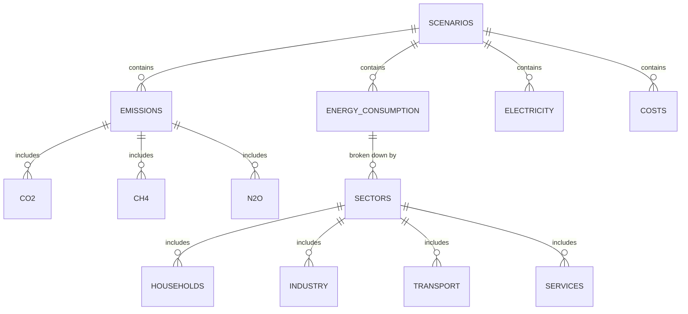

# 📊 Swiss Energy Scenarios Decipher System - Data Model Documentation

## Data Architecture Overview

The system processes 103 data files from Swiss Energy Perspectives 2050+, structured across multiple categories and formats.

---

## Data Sources Summary

| Category | Files | Format | Time Range | Description |
|----------|-------|--------|------------|-------------|
| **Synthesis Data** | 74 | CSV | 2000-2060 | Primary energy statistics and projections |
| **Transformation Data** | 13 | CSV | 2000-2060 | Electricity system transformation |
| **Technical Reports** | 16 | PDF | - | Methodology, analysis, and policy documents |

**Total: 103 data files**

---

## CSV Data Structure

### Common Schema Pattern

All CSV files follow a consistent structure:

```csv
variable,unit,year,value,scenario,variant
Bevölkerung,"Tsd., Jahresmittel",2000,7184.2,ZERO-Basis,KKW50
Bevölkerung,"Tsd., Jahresmittel",2001,7229.85,ZERO-Basis,KKW50
...
```

### Core Fields

| Field | Type | Description | Example Values |
|-------|------|-------------|----------------|
| **variable** | String | Energy/economic variable measured | "Bevölkerung", "CO2 Emissionen", "Stromverbrauch" |
| **unit** | String | Unit of measurement | "PJ", "TWh", "Mt CO2", "Tsd. Personen" |
| **year** | Integer | Year of data point | 2000, 2010, 2020, 2030, 2050 |
| **value** | Float | Numeric value | 7184.2, 45.6, 0.0 |
| **scenario** | String | Energy scenario | "ZERO-Basis", "WWB", "ZERO-A" |
| **variant** | String | Scenario variant | "KKW50", "ZERO-B", "REF" |

### Extended Schema Variations

Some files include additional fields:

| Field | Files | Description |
|-------|-------|-------------|
| **sector** | Industry, Services, Buildings | Economic sector classification |
| **fuel** | Energy consumption files | Energy carrier type |
| **technology** | Electricity generation | Power generation technology |
| **purpose** | Buildings, Transport | End-use application |
| **noga** | Industry files | Swiss economic activity classification |

---

## Data Categories

### 1. Demographics & Economics (01-*)

**Files**: `01-01` through `01-07`

| File | Variables | Description |
|------|-----------|-------------|
| **01-01-demography_economics.csv** | Population, GDP, value added | Economic fundamentals |
| **01-02-value_added_by_sector.csv** | Sectoral economic output | Industry, services, agriculture |
| **01-03-labor_full_time_equivalent.csv** | Employment by sector | Labor market projections |
| **01-04-energy_reference_area.csv** | Energy reference areas | Spatial energy demand |
| **01-05-energy_prices.csv** | Energy carrier prices | Oil, gas, electricity prices |
| **01-06-weather_climate.csv** | Climate variables | Temperature, heating/cooling days |
| **01-07-transport.csv** | Transport demand | Passenger and freight transport |

### 2. Emissions (02-*)

**Files**: `02-01` through `02-05`

| File | GHG Coverage | Sectors |
|------|--------------|---------|
| **02-01-emissions_ghg.csv** | All greenhouse gases | Total economy |
| **02-02-emissions_co2.csv** | Carbon dioxide | Energy-related CO2 |
| **02-03-emissions_ch4.csv** | Methane | Agriculture, waste, energy |
| **02-04-emissions_n20.csv** | Nitrous oxide | Agriculture, industry, transport |
| **02-05-emissions_fgas.csv** | F-gases | Refrigeration, industrial processes |
| **02-05-emissions_ghg_by_noga.csv** | GHG by economic sector | Industry classification |

### 3. Energy Consumption (03-04-*)

**Primary Energy (03-*)**:
- **03-01**: Gross energy consumption by fuel
- **03-02**: Gross energy consumption by sector

**Final Energy (04-*)**:
- **04-01**: Final energy consumption by fuel
- **04-02**: Final energy consumption by purpose and fuel
- **04-03**: Final energy consumption by sector
- **04-05**: Specific and per-capita targets
- **04-06**: Renewable energy consumption

### 4. Electricity System (05-*)

| File | Focus | Key Variables |
|------|-------|---------------|
| **05-01** | Consumption by sector | Industry, households, services, transport |
| **05-02** | Consumption by purpose | Lighting, motors, heating, cooling |
| **05-03** | Specific consumption | Per unit of output/area |
| **05-04** | Reduction targets | Efficiency improvements |

### 5. Sectoral Analysis (13-18-*)

#### Households (13-*)
- Energy consumption by fuel and purpose
- Electricity consumption patterns
- Residential heating and cooling

#### Services (14-*)
- Commercial building energy use
- Service sector electricity demand
- Economic activity correlation

#### Industry (15-*)
- Industrial energy consumption by NOGA sector
- Process heat requirements
- Manufacturing electricity demand

#### Transport (16-*)
- Modal energy consumption (road, rail, aviation)
- Fuel type transitions (electric, hydrogen)
- Passenger vs freight transport

#### Agriculture (17-*)
- Agricultural energy consumption
- Fuel and electricity use patterns

#### Buildings (18-*)
- Building energy consumption by purpose
- Heating system transitions
- Efficiency improvements

### 6. Technologies (07-12-*)

| Technology Category | Files | Key Metrics |
|-------------------|-------|-------------|
| **Renewables (07-*)** | 07-01 to 07-03 | Consumption by fuel, purpose, sector |
| **Biomass (08-*)** | 08-01 to 08-03 | Consumption patterns, waste share |
| **Gas System (09-*)** | 09-01 to 09-03 | Gas consumption, grid composition |
| **Power-to-X (10-*)** | 10-01 to 10-02 | Hydrogen, synthetic fuels |
| **District Heating (11-*)** | 11-01 to 11-03 | Heat networks, fuel sources |
| **Heat Pumps (12-*)** | 12-01 | Electricity consumption |

### 7. Economics (20-*)

**Cost Analysis Files**:
- **20-01**: Cost differences to WWB by cost type
- **20-02**: Investment costs by sector  
- **20-03**: Operation & maintenance costs
- **20-04**: Additional energy costs by fuel

---

## Transformation Data (Electricity System)

### Power Generation (02-*)

| File | Technology Coverage |
|------|-------------------|
| **02-01** | All generation technologies |
| **02-02** | Renewable sources detail |
| **02-03** | Hydropower breakdown |

### Capacity Planning (03-*)

| File | Capacity Metrics |
|------|-----------------|
| **03-01** | Installed capacity by technology |
| **03-02** | Renewable technology capacity |

### Seasonal Analysis (04-05-*)

| File | Seasonal Focus |
|------|----------------|
| **04-01, 04-02** | Winter electricity generation |
| **05-01, 05-02** | Summer electricity generation |

### System Integration (06-08-*)

- **06-01**: Electricity prices
- **07-01**: District heating integration
- **08-01**: Power-to-X electricity demand

---

## Scenario Framework

### Primary Scenarios

| Scenario | Abbreviation | Description |
|----------|--------------|-------------|
| **ZERO-Basis** | ZERO | Net-zero emissions by 2050 |
| **Weiter wie bisher** | WWB | Business-as-usual reference |
| **ZERO-A** | ZERO-A | ZERO variant A |
| **ZERO-B** | ZERO-B | ZERO variant B |
| **ZERO-C** | ZERO-C | ZERO variant C |

### Scenario Variants

| Variant | Description |
|---------|-------------|
| **KKW50** | Nuclear power plants operating until 2050 |
| **REF** | Reference technology assumptions |
| **Alternative assumptions** | Various sensitivity analyses |

### Key Scenario Differences

| Dimension | ZERO-Basis | WWB |
|-----------|------------|-----|
| **Climate Target** | Net-zero by 2050 | No specific target |
| **Renewable Share** | High expansion | Moderate growth |
| **Nuclear Phase-out** | By ~2034 | Gradual replacement |
| **Transport** | High electrification | Slow transition |
| **Buildings** | Heat pump deployment | Gradual renovation |
| **Industry** | Process electrification | Limited change |
| **Carbon Pricing** | Strong price signal | Current levels |

---

## Data Quality & Metadata

### Time Series Characteristics

| Attribute | Historical (2000-2020) | Projections (2021-2060) |
|-----------|----------------------|------------------------|
| **Data Source** | Official statistics | Model projections |
| **Frequency** | Annual | 5-year intervals (typically) |
| **Reliability** | High (observed) | Model-dependent |
| **Uncertainty** | Low | Increases with time horizon |

### Units and Conversions

| Energy Unit | Conversion | Usage |
|-------------|------------|-------|
| **PJ** | Petajoule (10^15 J) | Primary energy |
| **TWh** | Terawatt-hour | Electricity |
| **GWh** | Gigawatt-hour | Smaller electricity amounts |
| **MW/GW** | Power capacity | Installed capacity |
| **Mt CO2** | Million tonnes CO2 | Emissions |
| **kt CO2** | Thousand tonnes CO2 | Smaller emission sources |

### Data Validation Rules

1. **Temporal Consistency**: Values should follow logical progressions
2. **Unit Consistency**: Same variables use consistent units across files
3. **Scenario Logic**: ZERO scenarios should show emissions reductions
4. **Physical Constraints**: Energy balances must be maintained
5. **Cross-file Consistency**: Related variables across files should align

---

## Technical Documents Structure

### Document Categories

| Type | German Term | Count | Content Focus |
|------|-------------|-------|---------------|
| **Technical Report** | Technischer Bericht | 3 | Methodology, modeling details |
| **Summary Report** | Kurzbericht | 4 | Key findings, policy implications |
| **Fact Sheet** | Faktenblatt | 2 | Concise data presentations |
| **Special Study** | Exkurs | 6 | Deep-dives on specific topics |
| **Stakeholder Input** | Stellungnahmen | 1 | Consultation feedback |

### Document Metadata

```python
document_info = {
    "filename": "10783-EP2050+_TechnischerBericht_2022-04-12.pdf",
    "type": "Technical Report",
    "language": "German",
    "pages": 200,
    "topics": ["methodology", "modeling", "assumptions", "validation"],
    "date": "2022-04-12"
}
```

### Key Document Contents

| Document | Key Sections |
|----------|--------------|
| **Technical Report** | Methodology, model structure, assumptions, validation, uncertainty analysis |
| **Summary Report** | Executive summary, key results, policy implications, recommendations |
| **Biomass Study** | Biomass potential, sustainability constraints, technology options |
| **Winter Electricity** | Seasonal supply-demand balance, storage needs, import dependency |
| **CCS Study** | Carbon capture potential, costs, infrastructure requirements |

---

## Data Processing Pipeline

### ETL Process

```python
# Extract
csv_files = load_csv_files(data_path)
pdf_files = load_pdf_documents(reports_path)

# Transform  
normalized_data = standardize_schema(csv_files)
extracted_text = extract_pdf_content(pdf_files)

# Load
data_catalog = build_catalog(normalized_data, extracted_text)
search_index = create_search_index(data_catalog)
```

### Data Catalog Schema

```python
{
    "filename": "02-02-emissions_co2.csv",
    "category": "synthesis",
    "shape": [1250, 6],
    "columns": ["variable", "unit", "year", "value", "scenario", "variant"],
    "variables": ["CO2 Emissionen Total", "CO2 Emissionen Verkehr", ...],
    "scenarios": ["ZERO-Basis", "WWB"],
    "variants": ["KKW50", "REF"],
    "year_range": [2000, 2060],
    "units": ["Mt CO2"],
    "last_updated": "2024-01-15"
}
```

---

## Query Patterns & Data Mapping

### Common Query Types

| Query Pattern | Relevant Files | Processing Approach |
|---------------|----------------|-------------------|
| **"CO2 emissions in 2030"** | `02-02-emissions_co2.csv` | Filter by year, scenario |
| **"Renewable energy growth"** | `07-*-renewable*.csv` | Time series analysis |
| **"Transport electrification"** | `16-*-transport*.csv` | Fuel transition analysis |
| **"Building heat pumps"** | `12-01-heat_pump*.csv` | Technology deployment |
| **"Scenario comparison"** | Multiple files | Cross-scenario analysis |

### Data Relationships



This data model provides the foundation for intelligent query processing and ensures consistent, accurate responses across all system components.